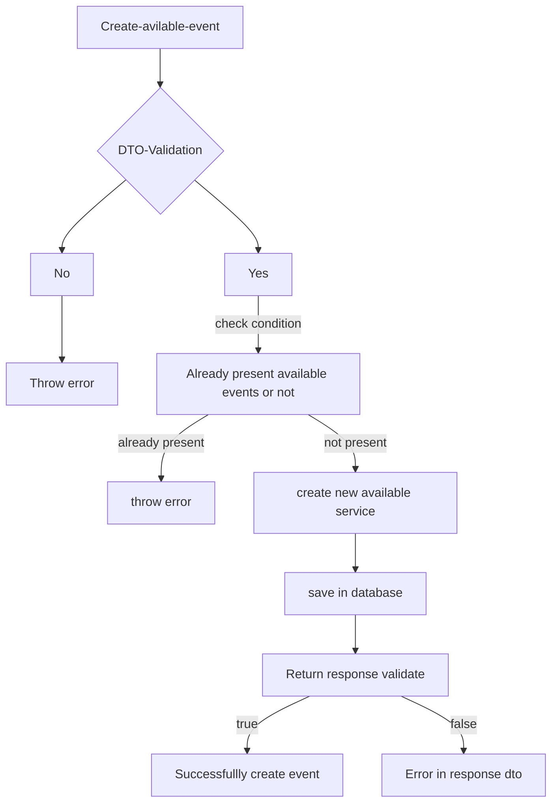
```mermaid
flowchart TD
    webhook-avilable-events[Create-avilable-event] --> B{DTO-Validation}
    B -->C[Yes]
    B -->D[No]
    D --> E[Throw error]
    C -->|check condition| F[Already present available events or not]
    F --> |already present|G[throw error ]
    F --> |not present|H[create new available service]
    H --> I[save in database]
    I --> J[Return response validate ]
    J -->|true|K[Successfullly create event]
    J -->|false|L[Error in response dto]

```

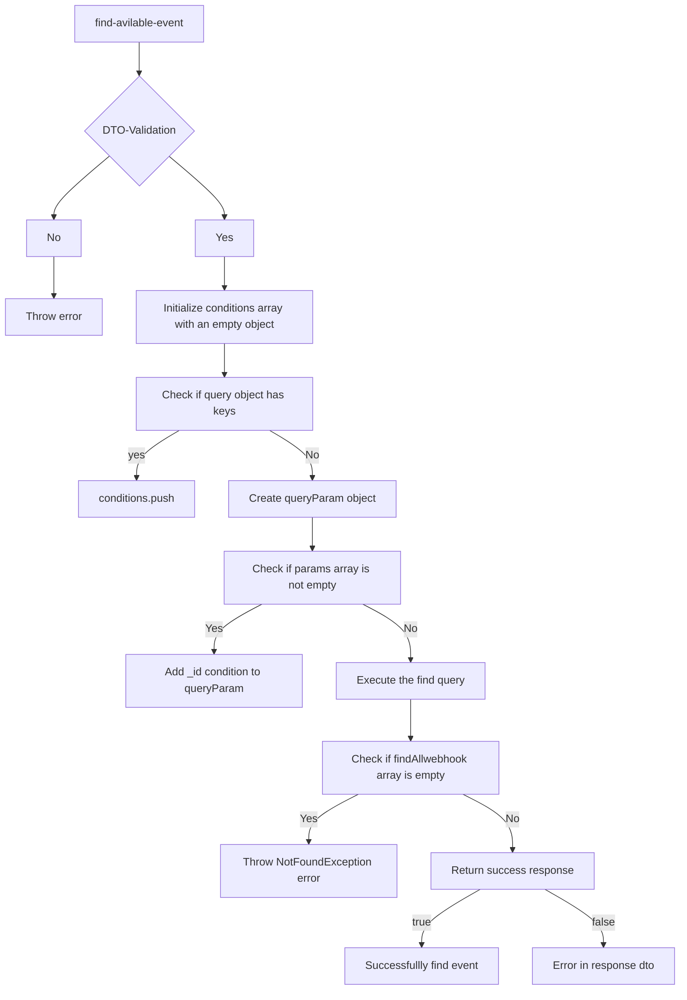
```mermaid
flowchart TD
    A[find-avilable-event] --> B{DTO-Validation}
    B -->C[Yes]
    B -->D[No]
    D --> E[Throw error]
    C --> F[Initialize conditions array with an empty object]
    F --> G[Check if query object has keys ]
    G --> |yes|H[conditions.push]
    G --> |No| I[Create queryParam object]
    I --> K[Check if params array is not empty]
    K -->|Yes|L[ Add _id condition to queryParam]
    K -->|No|M[Execute the find query]
    M -->N[Check if findAllwebhook array is empty]
    N -->|Yes|O[ Throw NotFoundException error]
    N -->|No|P[Return success response]
    P -->|true|Q[Successfullly find event]
    P -->|false|R[Error in response dto]
```    

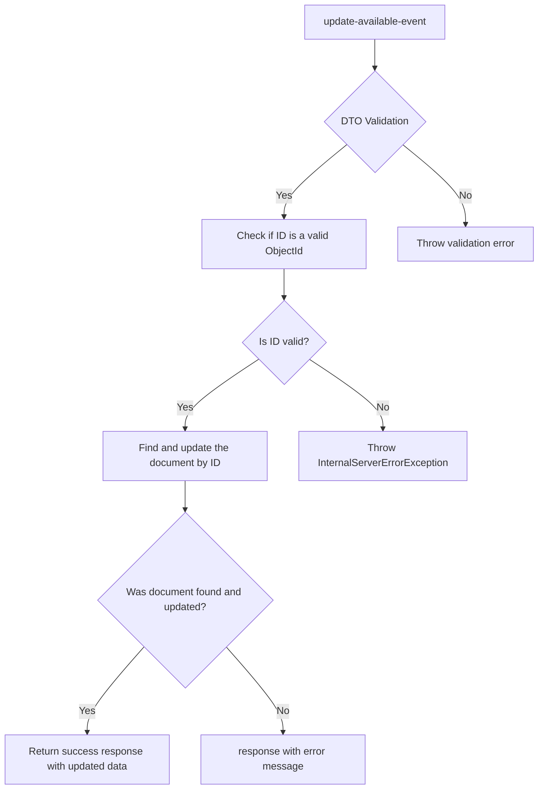
```mermaid
flowchart TD
    A[update-available-event] --> B{DTO Validation}
    B -->|Yes| C[Check if ID is a valid ObjectId]
    B -->|No| E[Throw validation error]
    C --> D{Is ID valid?}
    D -->|Yes| F[Find and update the document by ID]
    D -->|No| G[Throw InternalServerErrorException]
    F --> H{Was document found and updated?}
    H -->|Yes| I[Return success response with updated data]
    H -->|No| J[ response with error message]
```

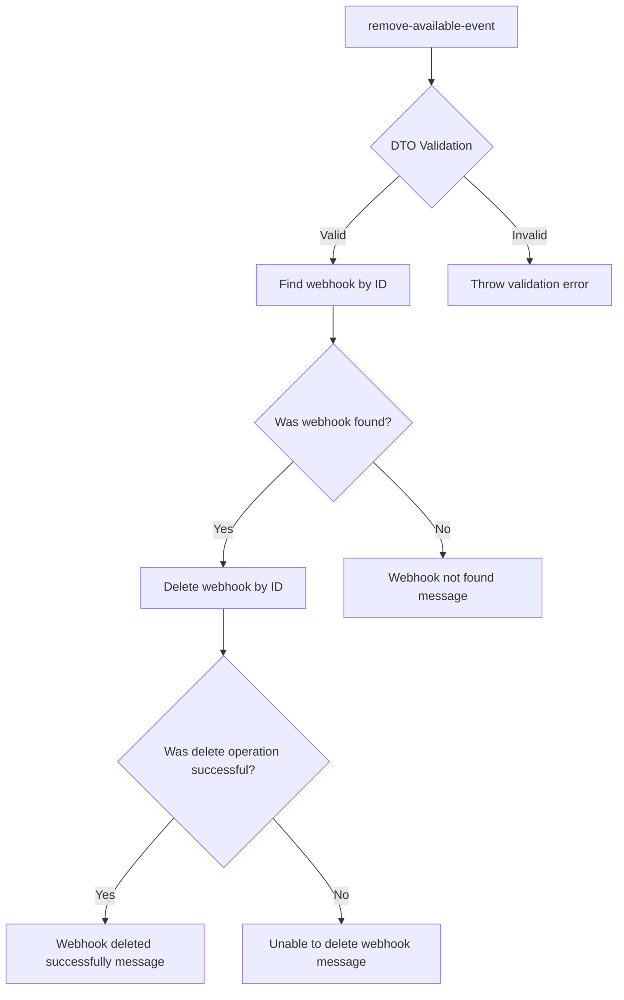
```mermaid
flowchart TD
    A[remove-available-event] --> B{DTO Validation}
    B -->|Valid| C[Find webhook by ID]
    B -->|Invalid| G[Throw validation error]
    C --> D{Was webhook found?}
    D -->|Yes| E[Delete webhook by ID]
    D -->|No| F[ Webhook not found message]
    E --> H{Was delete operation successful?}
    H -->|Yes| I[Webhook deleted successfully message]
    H -->|No| J[Unable to delete webhook message]
  
```

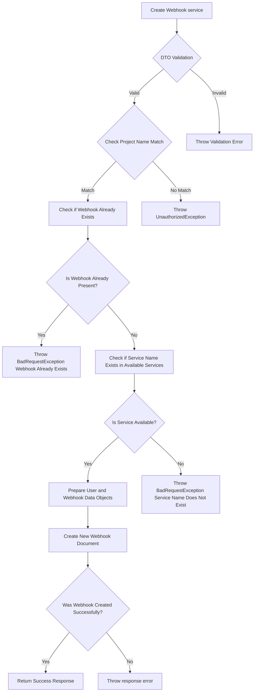
```mermaid
flowchart TD
    A[Create Webhook service] --> B{DTO Validation}
    B -->|Valid| C{Check Project Name Match}
    B -->|Invalid| Z[Throw Validation Error]
    C -->|Match| D[Check if Webhook Already Exists]
    C -->|No Match| G[Throw UnauthorizedException]

    D --> E{Is Webhook Already Present?}
    E -->|Yes| F[Throw BadRequestException Webhook Already Exists]
    E -->|No| H[Check if Service Name Exists in Available Services]

    H --> I{Is Service Available?}
    I -->|Yes| J[Prepare User and Webhook Data Objects]
    I -->|No| K[Throw BadRequestException Service Name Does Not Exist]

    J --> L[Create New Webhook Document]
    L --> M{Was Webhook Created Successfully?}
    M -->|Yes| N[Return Success Response ]
    M -->|No| O[Throw response error]
```

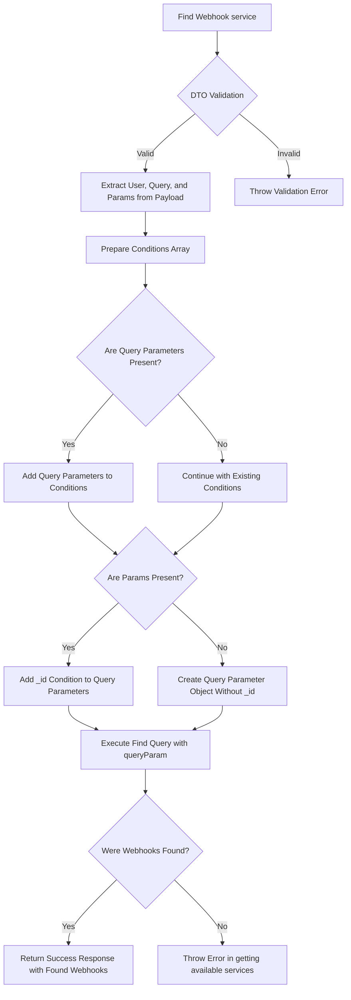
```mermaid
flowchart TD
    A[Find Webhook service] --> B{DTO Validation}
    B -->|Valid| C[Extract User, Query, and Params from Payload]
    B -->|Invalid| Z[Throw Validation Error]
    C --> D[Prepare Conditions Array]
    D --> E{Are Query Parameters Present?}
    E -->|Yes| F[Add Query Parameters to Conditions]
    E -->|No| G[Continue with Existing Conditions]

    F --> H{Are Params Present?}
    G --> H
    H -->|Yes| I[Add _id Condition to Query Parameters]
    H -->|No| J[Create Query Parameter Object Without _id]

    I --> K[Execute Find Query with queryParam]
    J --> K

    K --> L{Were Webhooks Found?}
    L -->|Yes| M[Return Success Response with Found Webhooks]
    L -->|No| N[Throw Error in getting available services]
```

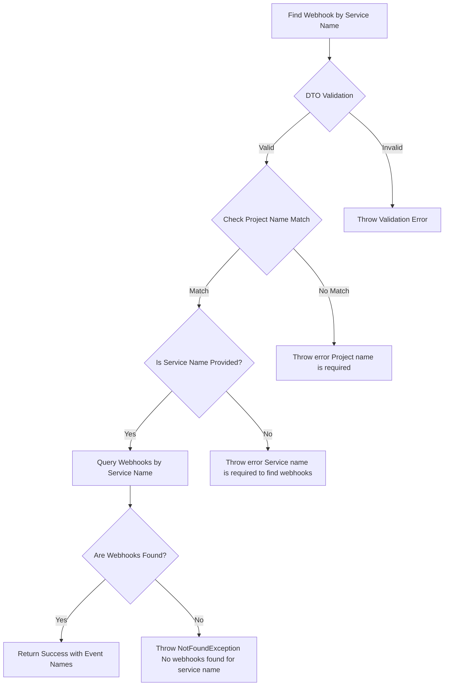
```mermaid
flowchart TD
    A[Find Webhook by Service Name] --> B{DTO Validation}
    B -->|Valid| C{Check Project Name Match}
    B -->|Invalid| Z[Throw Validation Error]

    C -->|Match| D{Is Service Name Provided?}
    C -->|No Match| Y[Throw error Project name is required]

    D -->|Yes| E[Query Webhooks by Service Name]
    D -->|No| X[Throw error Service name is required to find webhooks]

    E --> F{Are Webhooks Found?}
    F -->|Yes| G[Return Success with Event Names]
    F -->|No| H[Throw NotFoundException No webhooks found for service name]
```

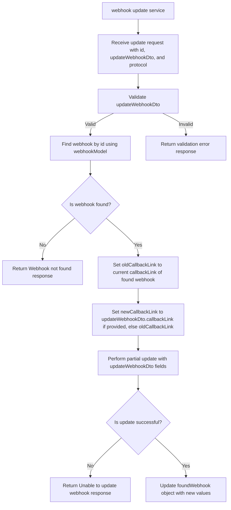
```mermaid
flowchart TD
    A[webhook update service] --> B[Receive update request with id, updateWebhookDto, and protocol]
    B --> C[Validate updateWebhookDto]
    C -->|Valid| D[Find webhook by id using webhookModel]
    C -->|Invalid| G[Return validation error response]

    D --> E{Is webhook found?}
    E -->|No| F[Return Webhook not found response]
    E -->|Yes| H[Set oldCallbackLink to current callbackLink of found webhook]

    H --> I[Set newCallbackLink to updateWebhookDto.callbackLink if provided, else oldCallbackLink]
    I --> J[Perform partial update with updateWebhookDto fields]

    J --> K{Is update successful?}
    K -->|No| L[Return Unable to update webhook response]
    K -->|Yes| M[Update foundWebhook object with new values]
```

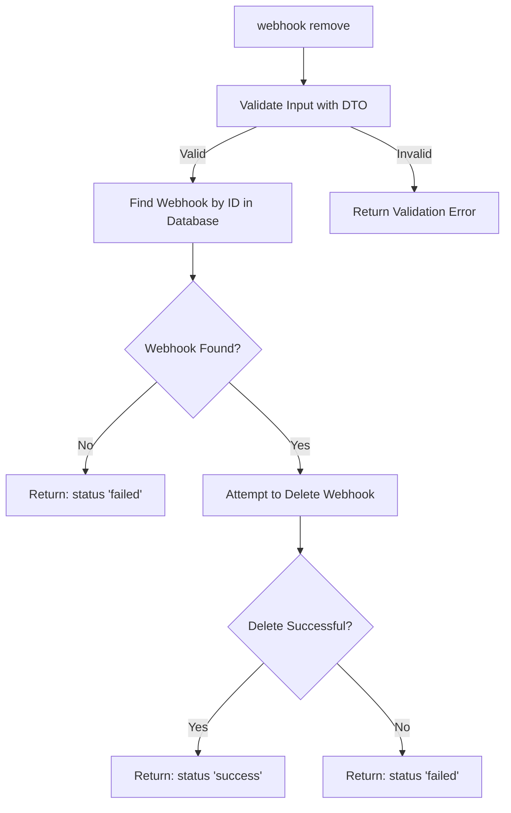
```mermaid
flowchart TD
    A[webhook remove] --> B[Validate Input with DTO]
    B -->|Valid| C[Find Webhook by ID in Database]
    B -->|Invalid| E[Return Validation Error]
    C --> D{Webhook Found?}
    D -->|No| F[Return: status 'failed']
    D -->|Yes| G[Attempt to Delete Webhook]
    G --> H{Delete Successful?}
    H -->|Yes| I[Return: status 'success']
    H -->|No| J[Return: status 'failed']
```

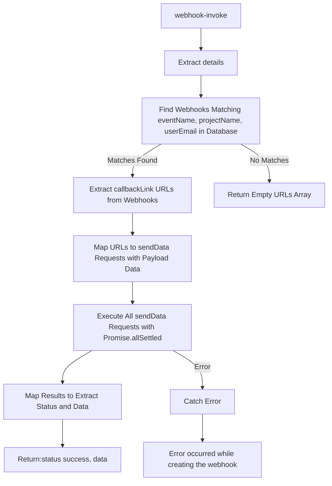
```mermaid
flowchart TD
 
    B[webhook-invoke] --> C[Extract details]
    C --> D[Find Webhooks Matching eventName, projectName, userEmail in Database]

    D -->|Matches Found| E[Extract callbackLink URLs from Webhooks]
    D -->|No Matches| G[Return Empty URLs Array]

    E --> F[Map URLs to sendData Requests with Payload Data]
    F --> H[Execute All sendData Requests with Promise.allSettled]
    H --> I[Map Results to Extract Status and Data]
    I --> J[Return:status success, data]
    
    H -->|Error| K[Catch Error]
    K --> L[Error occurred while creating the webhook ]
```

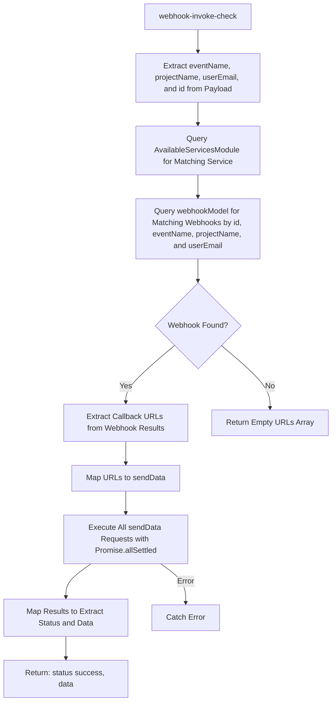
```mermaid
flowchart TD
    B[webhook-invoke-check]  --> C[Extract eventName, projectName, userEmail, and id from Payload]
    C --> D[Query AvailableServicesModule for Matching Service]
    D --> F[Query webhookModel for Matching Webhooks by id, eventName, projectName, and userEmail]
    F --> H{Webhook Found?}
    H -->|Yes| I[Extract Callback URLs from Webhook Results]
    H -->|No| J[Return Empty URLs Array]
    I --> K[Map URLs to sendData ]
    K --> L[Execute All sendData Requests with Promise.allSettled]
    L --> M[Map Results to Extract Status and Data]
    M --> N[Return: status success, data ]
    L -->|Error| O[Catch Error]
```
